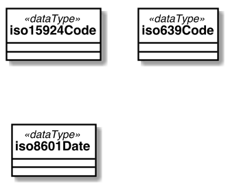
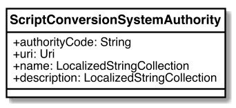
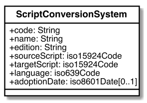

[[common-data]]
== Data model and attributes

=== Common data model and attributes

==== General

The data models in this clause are used by other data models specified in
this document.

==== Data models

[[iso-639]]
==== Usage of ISO 639 code elements

`iso639Code` represents code elements from <<ISO639-1>>, <<ISO639-2>>,
<<ISO639-3>> and <<ISO639-5>> for reference to languages.

[[iso-15924]]
==== Usage of ISO 15924 code elements

`iso15924Code` represents code elements from <<ISO15924>> for reference to
scripts.

[[iso-8601]]
==== Usage of ISO 8601 expressions

`iso8601Expression` represents datatime expressions that are compliant with
<<ISO8601>>.

[[sc-authority-data-model]]
=== System authority data model and attributes

==== General

==== authorityCode

A code that represents the script conversion system authority.

==== name

The identifiable short name that uniquely identifies the script conversion
system authority.

==== remarks

Any further notes.

[[sc-data-model]]
=== Conversion system data model and attributes

==== General

==== code

A code that identifies the script conversion system.

==== name

A name that represents the script conversion system.

==== language

The language code that identifies the source language being processed
by the script conversion system.

The language code should be qualified to a source of language codes.
For example, <<ISO639-1>>, <<ISO639-2>>, <<ISO639-3>>, <<ISO639-5>>
contain language codes that can be selected from.

If a synonym is used from <<ISO639-2>>, the ISO 639-2/T associated code should
be used. ISO 639-2/T codes are intended to be used for terminology applications.

==== sourceSpelling

The spelling system used in the source text.

==== targetScript

The spelling system used in the output text.

==== systemIdentifier

A system may be uniquely identified, amongst systems maintained by the same
authority, by an identifier, an edition, a version or a sequence of characters.

This element is mandatory if the authority manages or plans to manage multiple
script conversion systems.

It may be derived from the adoption date if and only if that does not cause
duplicates.
Otherwise the adoption date shall be complemented by the name or number of the
standard / technical specification, or some other data element.

[example]
`2013` is the system identifier of the system coded as `un-lao-laoo-latn-2013`.

==== relations

Script conversion systems can be related to other script conversion systems
in a number of ways. For example, a script conversion system may represent
an adoption or variant of another script conversion system.

Hierarchical structures of script conversion systems can be constructed by means
of relationships.

This element is optional.

`aliasOf`:: the current system is an alias to the target system, the script conversion process is identical
`adoptedFrom`:: the current system is adopted from the target system, the script conversion process may not be identical
`supercedes`:: the current system supercedes the target system
`replacedBy`:: the current system is replaced by the target system
`relatedTo`:: the current system is related to the target system
`basedOn`:: the current system is based on the target system, the script conversion process inherits certain attributes from the target system.

==== status

A system code may be optionally marked as deprecated or preferred.

NOTE: The deprecation marker in no way indicates deprecation of the system
itself.

==== remarks

Any further notes.

The date of the adoption of the script conversation system by the authority may
be noted in the remarks.

A typical use case is to show its original code from the original system from
where this code has been imported.

[example]
`NOTE: OGC 11-122r1 code urd_Arab2Latn_ODNI_2004`
